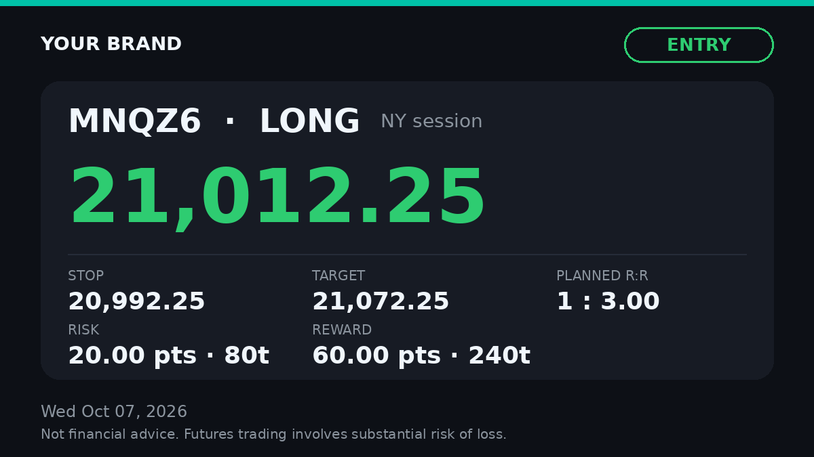
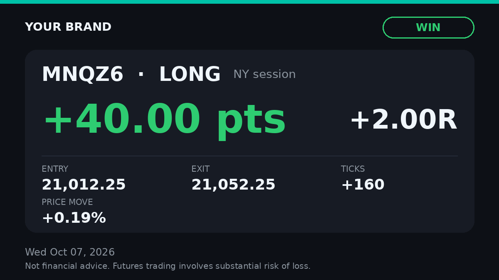

# Sofie: futures trading Discord bot

Sofie is a mostly autonomous community manager for a futures day-trading server (NQ/MNQ, ES/MES, CL/MCL, editable).
She posts your trades as branded graphics (points, ticks, % moves and R; never your dollar amounts unless you turn them on), runs the economic calendar, premarket plan and recap, keeps chat alive,
runs levels, challenges, giveaways and invite rewards, moderates, and DMs you a daily and weekly report.
Routine things happen on their own; risky things wait for your Approve button. Everything runs on free tiers.

Design and phased plan: [ARCHITECTURE.md](ARCHITECTURE.md) · Launch checklist: [bottom of this page](#launch-checklist)

### Where things stand
| Step | Status |
|---|---|
| 1. Questions | ✅ Answered: name **Sofie** (she/her); delete unused channels and tidy the server; your journal app sends trades; posts never show dollar amounts |
| 2. Architecture and phased plan | ✅ [ARCHITECTURE.md](ARCHITECTURE.md) |
| 3. Phase 1 (MVP): Sofie connects to your server | ✅ Built. You confirm it in [section 4, step 6](#step-6-phase-1-check-does-it-connect): she DMs you "connected" |
| 4. Everything else (trades, market posts, community, giveaways, rebuild, panel, hosting and health) | ✅ Built and tested offline (14 tests). Goes live when you finish sections 1, 2, 4 and 5 |

**Your order:** section 1 (create Sofie and add her to your server) → section 2 (free keys) → section 4 (cloud server; she comes online and DMs you) → section 5 (approve the upgrade plan she DMs you) → [launch checklist](#launch-checklist).

| Entry card | Result card |
|---|---|
|  |  |

---

## 1. Create the bot and add it to your server (10 minutes)

You do this part yourself (it's your Discord login). Every click, in order:

1. Open <https://discord.com/developers/applications> and log in → **New Application** → name it **Sofie** → tick the box → **Create**.
2. **General Information**: upload her profile picture (optional) and click **Copy** under **Application ID**. Keep it for step 5.
3. Left menu → **Bot**:
   - **Reset Token** → **Yes, do it!** → **Copy**. This is your `DISCORD_TOKEN`. Paste it only into the `.env` file on your
     server (section 4). Never post it anywhere, including here; if it leaks, click Reset Token again.
   - Scroll to **Privileged Gateway Intents** and turn **on** **Server Members Intent** and **Message Content Intent** → **Save Changes**.
   - If you skip this, the console loops on "session has been invalidated" (Discord close code 4014, "Disallowed intent(s)") and the bot never logs in.
   - Turn **off** **Public Bot** → **Save Changes** (so only you can add her to servers).
4. Left menu → **Installation** → set **Install Link** to **None** → **Save Changes**. (Otherwise Discord won't let you turn off Public Bot.)
5. Paste this into your browser with your Application ID in place of `YOUR_APP_ID`:
   `https://discord.com/oauth2/authorize?client_id=YOUR_APP_ID&scope=bot+applications.commands&permissions=573173922262133`
   It asks for exactly the permissions Sofie uses (manage roles, channels, webhooks, emojis and messages; send, embed, attach,
   polls; ban only after your approval). Pick **your server** → **Continue** → **Authorize** → solve the captcha.
6. Sofie now shows in your member list as **offline**. That's expected: she comes online when you start her (section 4).
7. **Server Settings → Roles**: drag the **Sofie** role to the **top** of the list (just under yours). Discord only lets a bot
   recolor roles that sit below its own.
8. In Discord: **User Settings → Advanced → Developer Mode** on. Right-click the server icon → **Copy Server ID** (`GUILD_ID`);
   right-click your own name → **Copy User ID** (`OWNER_ID`).
9. Right-click the server icon → **Privacy Settings** → allow **Direct Messages**, so her plan, Approve buttons and reports reach you.

## 2. Free API keys (5 minutes)

| What | Where | `.env` |
|---|---|---|
| Text AI (**Groq**, no card) | <https://console.groq.com/keys> | `LLM_PROVIDER=groq`, `LLM_API_KEY=` |
| Screenshot reading (**Gemini**, no card) | <https://aistudio.google.com/apikey> | `VISION_PROVIDER=gemini`, `VISION_API_KEY=` |
| GIFs (optional) | <https://developers.giphy.com/dashboard/> | `GIPHY_API_KEY=` |

You can also use Gemini for both (`LLM_PROVIDER=gemini`, same key), or Ollama locally with no keys at all.
Model names change; if a default stops working set `LLM_MODEL` / `VISION_MODEL` from the provider's model list.

## 3. (Optional) Quick test on your computer

Skip this if you'd rather go straight to the cloud; step 4 runs the same checks there.


```bash
cd discord-bot
python3 -m venv .venv && source .venv/bin/activate      # Windows: .venv\Scripts\activate
pip install -r requirements.txt
cp .env.example .env                                     # fill it in
python -m pytest tests                                   # offline checks, should say 14 passed
python main.py
```

## 4. Host it 24/7 in the cloud (free)

Sofie has to run on a server that never sleeps, not your computer. The recommended free option is an
**Oracle Cloud Always Free** virtual machine. Limits checked October 2026 on
[Oracle's Always Free page](https://docs.oracle.com/en-us/iaas/Content/FreeTier/resourceref.htm): Arm (Ampere A1)
machines get up to **2 CPUs and 12 GB of memory in total** for free. Oracle halved this from 4 CPUs/24 GB in
June 2026, so older guides are wrong. Sofie needs 1 CPU and 6 GB at most, which leaves room.

**Two things to know before you start**
- **Card check.** Oracle asks for a card to prove you're a real person. Always Free machines aren't charged.
- **Idle machines can be taken back.** Oracle's rule: an *Always Free* machine that is under 20% CPU, network
  and memory use for 7 days "may be reclaimed". A Discord bot is very light, so it can look idle. The usual fix is to
  upgrade the account to **Pay As You Go** (step 2). Your Always Free machine stays $0, and you add a $1 budget alert
  so you'd hear about any charge. This is how most people keep free bots alive. If you'd rather not, stay on the free account:
  your daily "online" DM tells you within a day if the machine disappears, and step 9 keeps backups so you can rebuild it in 15 minutes.

### Step 1: Create the account (10 min)
1. Go to <https://www.oracle.com/cloud/free/> → **Start for free**.
2. **Home region**: pick one close to you with spare capacity (e.g. *US East (Ashburn)* or *US West (Phoenix)*).
   You can't change it later.
3. Finish the email, phone and card checks. It can take a few minutes for the account to be ready.

### Step 2 (recommended): Upgrade to Pay As You Go and add a budget alert (5 min)
1. Menu ☰ → **Billing & Cost Management** → **Upgrade and Manage Payment** → **Pay As You Go**.
2. Menu ☰ → **Billing & Cost Management** → **Budgets** → **Create Budget**: amount **$1**, alert at **1%**, your email.
   If anything ever costs money you'll get an email straight away.

### Step 3: Create the server (10 min)
1. Menu ☰ → **Compute** → **Instances** → **Create instance**. Name it `sofie`.
2. **Image and shape** → **Edit**:
   - Image: **Change image** → **Ubuntu** → **Canonical Ubuntu 24.04**.
   - Shape: **Change shape** → **Ampere** → **VM.Standard.A1.Flex**, set **1 OCPU** and **6 GB** memory.
     It must say **Always Free-eligible**.
   - If you get **"Out of capacity"**, try another *Availability domain* at the top, or try again later. Or use
     **Specialty and previous generation → VM.Standard.E2.1.Micro** (also Always Free, 1 GB memory, enough for Sofie).
3. **Add SSH keys** → **Generate a key pair for me** → **Download private key**. Keep that file safe; it's your only way in.
4. Leave the rest as is → **Create**. Wait until it says **Running**, then copy the **Public IP address**.

Sofie needs no open ports; she only makes outgoing connections to Discord, so don't change any firewall settings.

### Step 4: Connect to the server
- **Windows**: open **PowerShell** and run
  `ssh -i C:\Users\YOU\Downloads\ssh-key-XXXX.key ubuntu@PUBLIC_IP`
- **Mac**: open **Terminal** and run
  `chmod 400 ~/Downloads/ssh-key-XXXX.key` then `ssh -i ~/Downloads/ssh-key-XXXX.key ubuntu@PUBLIC_IP`

Type `yes` the first time. You're in when the prompt says `ubuntu@sofie`.

### Step 5: Install Sofie (10 min)
1. On the server:
   ```bash
   sudo apt update && sudo apt -y upgrade
   sudo apt install -y python3-venv fonts-dejavu-core unzip
   sudo timedatectl set-timezone America/New_York
   ```
2. On **your computer** (a second PowerShell/Terminal window), copy the zip up:
   `scp -i PATH/TO/ssh-key-XXXX.key discord-bot.zip ubuntu@PUBLIC_IP:~`
3. Back on the server:
   ```bash
   unzip discord-bot.zip && cd discord-bot
   python3 -m venv .venv && .venv/bin/pip install -r requirements.txt
   cp .env.example .env && nano .env      # paste your token, IDs and keys; Ctrl+O, Enter, Ctrl+X to save
   chmod 600 .env                         # only you can read your secrets
   .venv/bin/python -m pytest tests       # should say 14 passed
   ```

### Step 6: Phase 1 check: does it connect?
Run `.venv/bin/python main.py`. Within a few seconds Sofie DMs you
**"✅ Sofie is connected. Phase 1 check passed: I can see <your server>"**, and her slash commands appear in your server.
No DM? Check that DMs from server members are allowed (section 1, step 9) and look at the error on screen.
She'll also DM you the server upgrade plan (section 5). Leave it for now: press **Ctrl+C** to stop her, do step 7,
then tap **Approve** on that DM. The button keeps working after a restart.

### Step 7: Run her 24/7 with auto-restart
```bash
sudo cp deploy/tradingbot.service /etc/systemd/system/
sudo systemctl daemon-reload
sudo systemctl enable --now tradingbot    # starts now and after every reboot
systemctl status tradingbot               # should say "active (running)"
```
What keeps her up:
- **Crash** → systemd restarts her after 10 seconds, forever. You get a DM: *"I stopped unexpectedly and restarted myself."*
- **Server reboot** (Oracle maintenance, or you) → she starts on boot. A normal stop or reboot doesn't trigger the crash DM.
- **Frozen connection** → if she loses Discord for 10 minutes, she exits on purpose so systemd restarts her fresh.
- **Every morning** at `STATUS_HOUR` (8:00 by default) she DMs **"🟢 Sofie is online"**: uptime, restarts and errors in
  the last 24h, anything waiting for your approval, and free disk space. `/health` shows the same thing any time.
  **If that DM doesn't arrive, she's down**: log in and run `sudo systemctl restart tradingbot`, then check the logs.

Test it: `sudo reboot`, wait 2 minutes, and check that she's back online in Discord.

### Step 8: Logs
| You want | Run |
|---|---|
| Live log | `journalctl -u tradingbot -f` (Ctrl+C to exit) |
| Today's log | `journalctl -u tradingbot --since today` |
| Only errors | `journalctl -u tradingbot -p err --since "2 days ago"` |
| From Discord | `/logs` (owner only; `errors_only:True` for problems) |

Log files also live in `data/logs/` (5 files of 5 MB, oldest deleted automatically). Cap the system log too:
```bash
sudo mkdir -p /etc/systemd/journald.conf.d && sudo cp deploy/journald-size.conf /etc/systemd/journald.conf.d/
sudo systemctl restart systemd-journald
```

### Step 9: Daily backups
`data/bot.db` holds trades, the edit log, XP, giveaways and settings.
```bash
crontab -e        # choose nano, then add this line at the bottom and save:
30 3 * * * /home/ubuntu/discord-bot/deploy/backup.sh
```
That keeps 14 daily copies in `data/backups/`. Once a week, pull one to your computer:
`scp -i PATH/TO/key ubuntu@PUBLIC_IP:~/discord-bot/data/backups/* .`

### Updating Sofie later
With `UPDATE_REPO` set in `.env` (see the Wispbyte section), `sudo systemctl restart tradingbot` is enough. Otherwise:
```bash
sudo systemctl stop tradingbot
cd ~ && unzip -o discord-bot.zip -x 'discord-bot/.env' 'discord-bot/data/*'   # keeps your settings and data
cd discord-bot && .venv/bin/pip install -r requirements.txt
sudo systemctl start tradingbot
```

### No card? Wispbyte (free, no card)
If Oracle keeps declining your card, [Wispbyte](https://wispbyte.com/free-discord-bot-hosting) hosts Discord bots for free with
**no card**. Its own pages (checked October 2026) say the free plan has **512 MB memory** (enough for Sofie), runs 24/7, and the
server is never deleted, but you must **log in at least every two weeks** to keep it. It's a smaller company than Oracle, so keep backups.

1. Sign up at <https://wispbyte.com>, then **Create server** → pick the **Python** option.
2. Open the server → **Files** → **Upload** the contents of the `discord-bot` folder (unzip on your computer first, then
   upload everything inside it, including `requirements.txt`, `main.py`, `bot/` and `assets/`).
3. Create a file named `.env` there and paste your settings into it (same as `.env.example`, with your token and IDs).
4. **Startup** tab: set the start file to `main.py` and make sure requirements install from `requirements.txt`.
5. **Console** → **Start**. When Sofie says she's connected (and DMs you), you're live.

What changes compared to Oracle: there's no systemd, so the host's panel restarts her after a crash (test it once with **Restart**).
Logs are in the panel's **Console** and `/logs` in Discord. The daily "🟢 Sofie is online" DM works the same, and it's your
alarm if anything stops. Back up `data/bot.db` from **Files** now and then.

**Updating without uploads:** put the code in a GitHub repo and add `UPDATE_REPO=your-name/sofie` to `.env`
(plus `UPDATE_TOKEN=` with a read-only fine-grained token if the repo is private). Every **Restart**, Sofie downloads the
latest code first (`updater.py`; `.env` and `data/` are never touched). The console shows `Self-update: ...` with the result.

### If Oracle doesn't work out: Google Cloud
Google's free tier includes **one e2-micro VM** (2 shared CPUs, 1 GB memory) that "does not expire, but is subject to change"
([Google Cloud Free](https://cloud.google.com/free)). It's only free in **us-west1, us-central1 or us-east1**, with a standard
disk up to 30 GB. Outbound traffic beyond about 1 GB a month is billed (pennies; trade images are around 100 KB each).
A card is required. Steps 4 to 9 are the same (the user name is yours instead of `ubuntu`, so edit `User=` and the paths in
`deploy/tradingbot.service`). Free web hosts that sleep when idle (Render, Replit, Koyeb web, Vercel) don't work for Discord bots.

A `Dockerfile` is included if you prefer Docker (mount `/app/data`, and use `--restart unless-stopped`).

## 5. The server upgrade (starts by itself)

The first time Sofie comes online in your server (section 4, step 7), she starts the upgrade on her own:

1. **Snapshot**: she saves every channel, role and permission, and DMs you the snapshot file.
2. **Plan**: she DMs you the full plan (`rebuild-plan.md`) and one message with **Approve / Deny**. It lists how many changes
   each stage makes and **names every channel that would be deleted**. Nothing has changed yet.
3. **Approve** once and she applies all seven stages in order, with no more prompts:
   1. Roles and colors · 2. Categories and channels with emoji names (your existing ones are renamed and moved, e.g.
   #general, #signals → #trade-entries) · 3. Permissions · 4. Leftover channels go to a hidden **🗄 ARCHIVE** (history kept)
   · 5. Rules and welcome messages with buttons, role picker, invite info, staff cheat sheet, custom emojis and stickers
   · 6. Cleanup: deletes only the channels listed in the plan (no messages for 60 days), DMing you a text backup of each first,
   then puts every category and channel in a clean order. A listed channel that gets a new message before then is kept.
   · 7. Polish: orders the roles so colors show on names, gives you a gold **👑 Founder** role, pins a styled header embed
   in every channel, and gives existing members the **Trader** role so the new layout doesn't lock them out.
4. **Summary**: when it's done she DMs you what changed in each stage and anything that went wrong.
5. **Deny** instead and nothing changes. You can start again any time with `/rebuild plan`.

Upgraded before stage 7 existed? Run `/rebuild polish` and approve it in your DMs.
Changed your mind afterwards? `/rebuild undo stage:3` reverts one stage; `/rebuild undo stage:0` reverts everything.
Deleted channels come back empty (Discord can't restore messages; you have the backups). `/rebuild status` shows progress.
Prefer to approve stage by stage? `/rebuild plan mode:approve each stage`. Don't want the automatic start? Set `AUTO_REBUILD=off` in `.env`.

Drop your own PNGs into `assets/emojis/` (128×128) and `assets/stickers/` (320×320) before you start Sofie to upload them too.

---

## Daily use

**Posting trades (owner)**
- Type in **#trade-submit**: `long MNQZ6 21012.25 sl 20992.25 tp 21072.25 x3 ORB retest`, `close 12 at 21052.25`, or drop a
  **screenshot** or a **CSV**. You get a confirm card: **Post it / Edit / Cancel**. Nothing posts until you tap Post.
- Or `/trade` (posts immediately; add `exit` for a closed trade), `/close`, `/submit`, `/import-journal`, `/open-trades`.
- Fix anything later: `/edit target:#12 field:Exit value:21060` regenerates the card and updates the original message.
  `/edit-history #12` shows the originals and every change. `caption` + `auto` rewrites the caption.
- Symbols: `/symbols list | add | remove` (e.g. add GC with tick 0.1 = $10, data ticker `GC=F`).
- `/submit file:` takes a screenshot, a CSV or a JSON file. `/export-trades` gives you every posted trade as a CSV.

**What posts show (owner)** By default, cards and posts show points, ticks, % price move and R. They never show dollar
amounts or your contract count. `/display account_size:50000` adds "% of account" (the size itself is never posted).
`/display show_dollars:True show_contracts:True` turns $ on for everything; `/trade ... show_dollars:True` or
`/edit field:Show $ and contracts value:on` does it for one trade. Your private DM reports still show $.

**Your journal app (owner)** Run `/journal-link action:new`. Sofie makes a webhook in #trade-submit and shows you its URL
(treat it like a password; `/journal-link action:revoke` kills it). Your app POSTs to that URL and every trade it sends gets
the same confirm card, so nothing posts until you tap **Post it**. Send any of these:
- A screenshot or a CSV as a file upload (`multipart/form-data`, field `files[0]`), same as dropping it in the channel.
- JSON, either as a `.json` file (best for many trades) or as the message text: `{"content": "<the JSON below as a string>"}` (2,000 characters max).

```json
{"trades": [
  {"symbol": "MNQZ6", "side": "long", "entry": 21012.25, "exit": 21052.25, "stop": 20992.25, "target": 21072.25,
   "contracts": 2, "entry_time": "2026-10-07T09:45:00-04:00", "exit_time": "2026-10-07T10:12:00-04:00",
   "notes": "ORB retest", "show_dollars": false},
  {"close_of": 12, "exit": 5871.5}
]}
```
Required: `symbol`, `side` (long/short/buy/sell), `entry`. Everything else is optional. `close_of` + `exit` closes an open trade.
A single object without the `trades` list also works. If you made the webhook yourself in the channel settings, run `/journal-link action:adopt`.

**Control panel (owner)** `/feature list|set|mode` · `/teach add|list|edit|remove` · `/perm list|set` · `/staff-roles` ·
`/identity name avatar personality brand_name brand_color_hex` · `/display` · `/journal-link` · `/export-trades` · `/pause` `/resume` `/kill` · `/status` · `/announce`

**Giveaways** `/sponsor add name:Lucid sizes:25K,50K,150K link:... rules:...` then
`/giveaway create request:two Lucid accounts for 3 days`. It asks with buttons for anything missing (size, winners, duration, channel),
shows a preview, and posts when you tap Post (leaders' drafts come to your DMs). Staff: `/giveaway list|end|reroll|log`; owner: `cancel|edit`.

**Market** posts itself on weekdays (NY time): calendar 7:00 + alerts 15 min before events, premarket 8:45, recap 16:15, weekly performance Fri 16:45.
Post now with `/market post`.

**Community** `/share-trade` (members, screenshot required) · `/challenge standings|start|dq` · `/rank` · `/leaderboard` ·
`/invites` · `/invite-leaderboard` · `/poll` · `/spark` · `/social platform:x` · `/experiments`

**Reports** arrive by DM at `REPORT_HOUR` daily, plus the weekly one on Sundays. `/report` for one now.

**Health (owner)** "🟢 Sofie is online" DM every morning at `STATUS_HOUR` · a DM after any crash restart · `/health` · `/logs`

---

## Launch checklist

- [ ] Bot created, **Public Bot off**, both privileged intents on, token in `.env` only
- [ ] `OWNER_ID`, `GUILD_ID`, Groq key, Gemini key in `.env`; `python -m pytest tests` passes
- [ ] Bot invited with the permission link; bot role dragged to the top of the role list
- [ ] DMs from server members allowed (you'll get approvals and reports)
- [ ] `/identity` avatar, brand name and color set (name defaults to Sofie)
- [ ] `/display account_size:` set if you want "% of account" on result cards
- [ ] `/journal-link action:new` and your journal app pointed at the URL; send one test trade
- [ ] Upgrade plan reviewed in DMs (check the delete list) and approved; summary DM received; channels and permissions checked as a normal member (use an alt or "View Server As Role")
- [ ] `/staff-roles` mapped (or give people the Leaders / Mods roles); `/perm list` reviewed
- [ ] `/teach add` your house rules (e.g. "never post during FOMC", "no posts about crypto")
- [ ] `/feature list`: turn off anything you don't want yet; set `ask` mode on anything you want to approve first for the first week
- [ ] Test a trade end to end in #trade-submit (text and a screenshot), then `/edit` it and check `/edit-history`
- [ ] `/market post premarket plan` and `/spark lesson` to see the content style
- [ ] `/sponsor add` your sponsors; run a small test giveaway with a 1-hour duration
- [ ] Deployed on Oracle (Pay As You Go + $1 budget alert recommended) with systemd; got the "connected" DM
- [ ] `sudo reboot` once and confirm she comes back by herself; next morning's "🟢 Sofie is online" DM arrived
- [ ] journald cap and the daily backup cron installed
- [ ] Pulled one backup to your computer; note where your `.env` lives
- [ ] Announce the relaunch with `/announce ping_everyone:true` (approve it in DMs)

## Project layout

```
main.py                    entry point
main.py also sets up rotating log files and clean shutdown
bot/core.py                bot class, intents, sharding, message pipeline, DM kill switch
bot/control.py             publish(), features & modes, staff permissions, persona, rulebook gate
bot/safety.py              action log, Approve/Deny buttons, risky-action handlers
bot/futures.py             contract specs, symbol parsing, points/ticks/%/R, sessions, what posts may show
bot/graphics.py            branded entry/result cards     bot/graphics_emoji.py   default custom emojis
bot/llm.py                 free text + vision AI client  bot/db.py               SQLite storage
bot/util.py                server layout, roles, branding
bot/cogs/trades.py         intake (text, screenshot, CSV, JSON, journal webhook), confirm cards, posting, /symbols, export
bot/cogs/edit.py           /edit, /edit-history
bot/cogs/panel.py          /teach, /feature, /perm, /identity, /display, kill switch, /status, /announce
bot/cogs/giveaways.py      sponsors, giveaways, draws, claims, re-draws
bot/cogs/rebuild.py        snapshot, plan, staged apply, cleanup, undo
bot/cogs/market.py         calendar, alerts, premarket, recap, weekly performance
bot/cogs/engagement.py     replies, questions, polls, lessons, setups, GIFs, quiet starters
bot/cogs/community.py      member trades, journal, weekly challenges
bot/cogs/experiments.py    weekly self-proposed experiments and scoring
bot/cogs/growth.py         invite tracking & rewards, social ideas with tracked links
bot/cogs/onboarding.py     welcome, rules button, role buttons     bot/cogs/levels.py   XP, ranks
bot/cogs/moderation.py     scams, spam, raids                       bot/cogs/reports.py  daily/weekly DMs
bot/cogs/health.py         daily online DM, crash-restart DM, watchdog, /health, /logs
deploy/                    systemd service, journald cap, daily backup script
tests/test_smoke.py        offline tests
```
